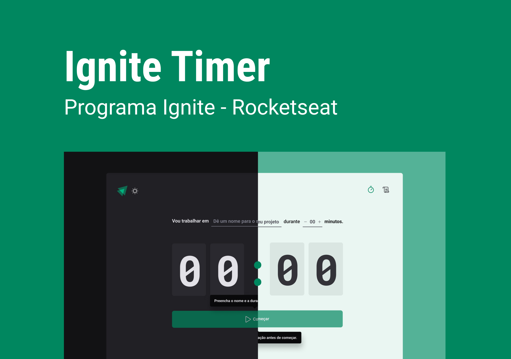

<h1 align="center"> Focus Clock </h1>

Trabalho exclusivo a assinantes do plano Ignite, promovido pela Rocketseat para ensino de tecnologias WEB.

  <a href="#-tecnologias">Tecnologias</a>&nbsp;&nbsp;&nbsp;|&nbsp;&nbsp;&nbsp;
  <a href="#-projeto">Projeto</a>&nbsp;&nbsp;&nbsp;|&nbsp;&nbsp;&nbsp;
  <a href="#memo-licença">Licença</a>

  

 

## 🚀 Tecnologias

Esse projeto foi desenvolvido com as seguintes tecnologias:

- Next.js
- Vite
- TypeScript
- ReactJS
- Styled Components
- Local Storage

## 💻 Projeto

O "Ignite Timer" é uma aplicação em React que permite aos usuários adicionar e interromper tarefas em seus dispositivos locais. provido pela Rocketseat e nomeado na minha versão como "Focus Clock". Ela oferece uma interface intuitiva e amigável, projetada para facilitar a organização das atividades diárias.

**Principais recursos do Focus Clock:**

• Adicionar tarefas: Os usuários podem criar novas tarefas, fornecendo um título para cada uma delas;

• Interromper tarefas: Os usuários têm a opção de interromper tarefas concluídas ou aquelas que não são mais relevantes, mas deixando em seu histórico;

• Salvamento no armazenamento local: As tarefas são armazenadas localmente no dispositivo do usuário, permitindo que ele acesse suas tarefas mesmo após fechar e reabrir o aplicativo;

## :memo: Licença

Esse projeto está sob a licença MIT.

---

Feito com ♥ by Gustavo Favero :wave: [Participe da nossa comunidade!](https://discord.gg/rocketseat)
